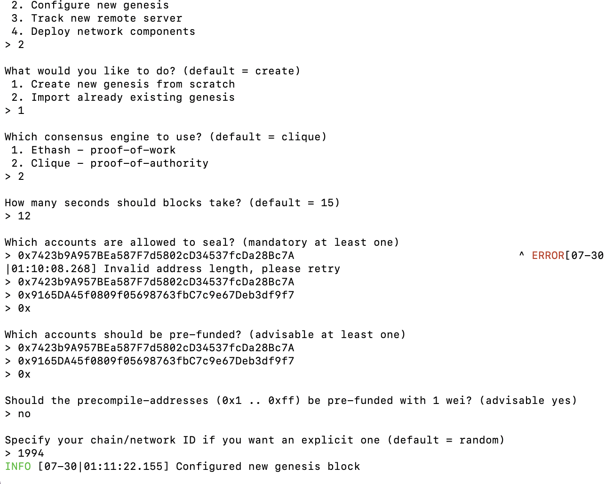
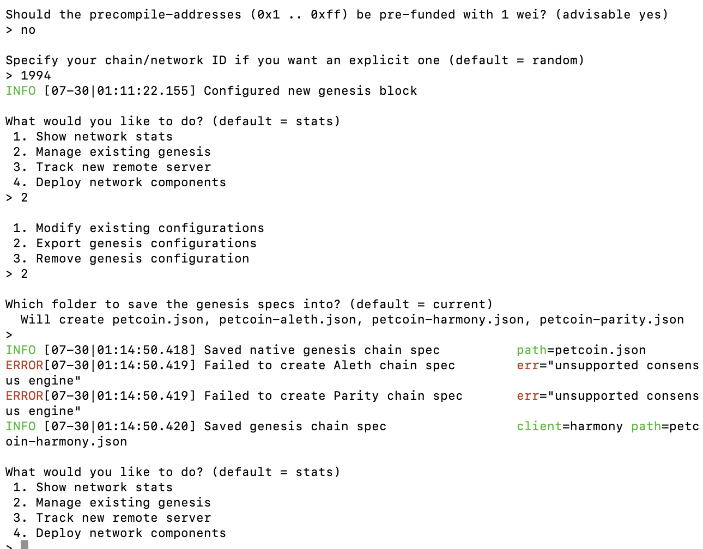

# Proof of Authority Development Chain

## Background
In this assignment, the task was to set up a Testnet on the blockchain using the following tools:
- Puppeth, to generate a genesis block.
- Geth, in the command line, to create keys, initialize nodes, and connect the nodes together.
- The Clique Proof of Authority algorithm.

## Generate two nodes with new addresses:
I created two nodes for this blockchain, dognode1 and catnode2.
In the command line:
    * ./geth --datadir dognode1 account new
    * ./geth --datadir catnode2 account new

## Generate genesis block:
In the command line, I ran puppeth to create a Proof of Authority blockchain. The new blockchain is called Petcoin, and runs on two nodes - dognode1 and catnode2. 
The addresses that were assigned to each node when they were created using Geth, have been assigned to the new POA blockchain in the list of accounts to seal and pre-fund here:

Below is the final puppeth configuration of petcoin:

## Initializing Nodes:
To initialize the the nodes with the genesis' json file:
    * ./geth --datadir dognode1 init petcoin.json
    * ./geth --datadir catnode1 init petcoin.json

## Running the nodes to mine blocks:
I ran the first node to unlock the account and enable mining, and the RPC flag by running the following command in a new terminal:
    *./geth --datadir dognode1 --unlock "ADDESS of dognode1" --mine --rpc --allow-insecure-unlock

In a separate terminal, I set a different peer port for the second node and use the first node's enode address as the bootnode flag:
    *./geth --datadir node2 --unlock "Address of catnode2" --mine --port 30304 --bootnodes "Encoded Address from dognode1" --ipcdisable --allow-insecure-unlock

## Transact with petcoin blockchain:
Now that dognode1 and catnode 2 are running the new petcoin blockchain, I can add the blockchain to MyCrypto to begin transacting.

Using MyCrypto GUI wallet, I connected the node with the exposed RPC port. For this blockchain, the node name and network name are "petcoin" and I added the Chain ID and used ETH as currency.

## Successful Transaction:

Import the private key by uploading the keystore file from dognode1.

Successful ETH transaction from dognode1 to catnode2:

